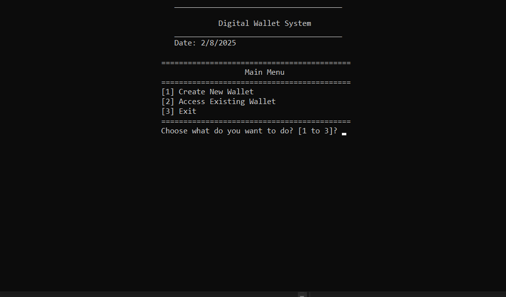
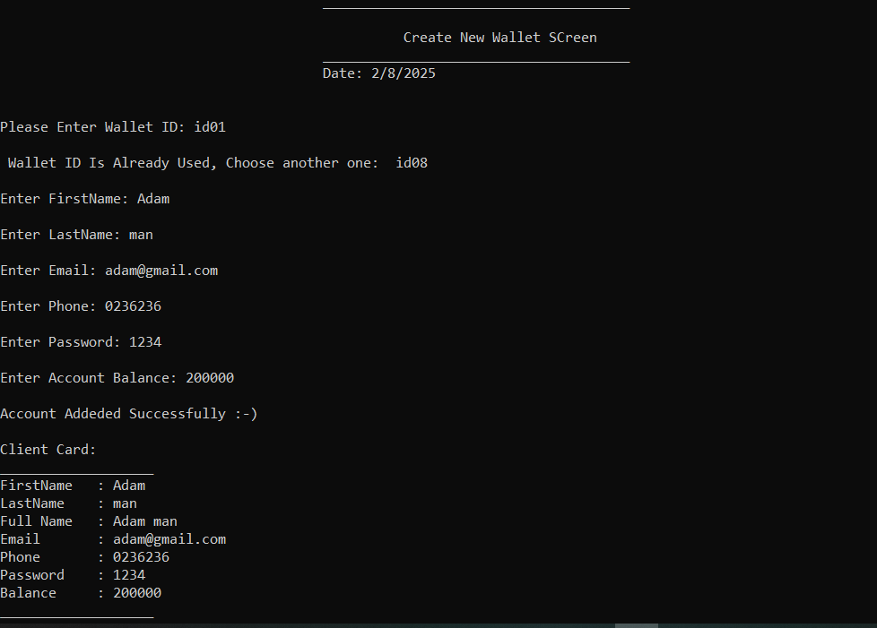
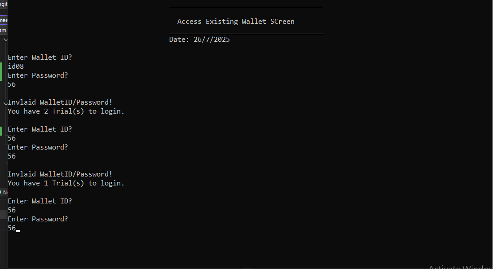
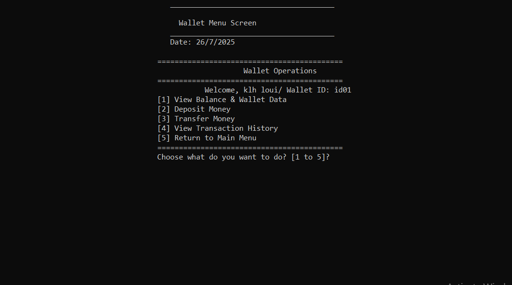
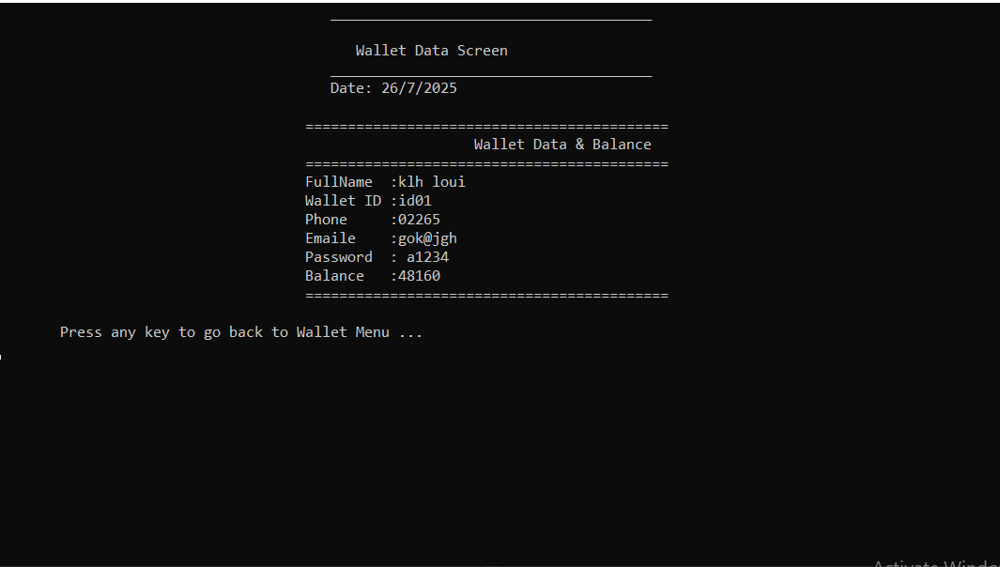
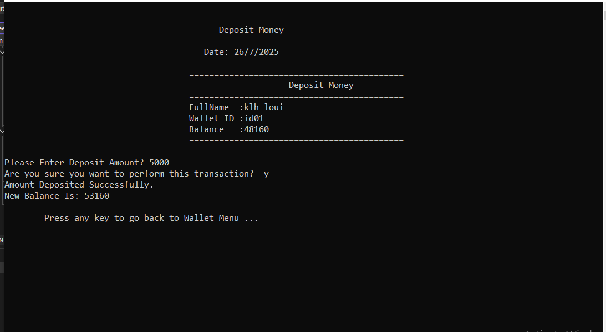
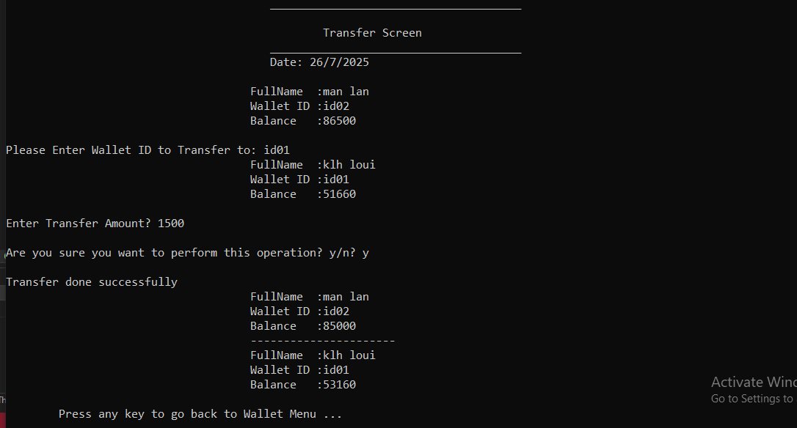
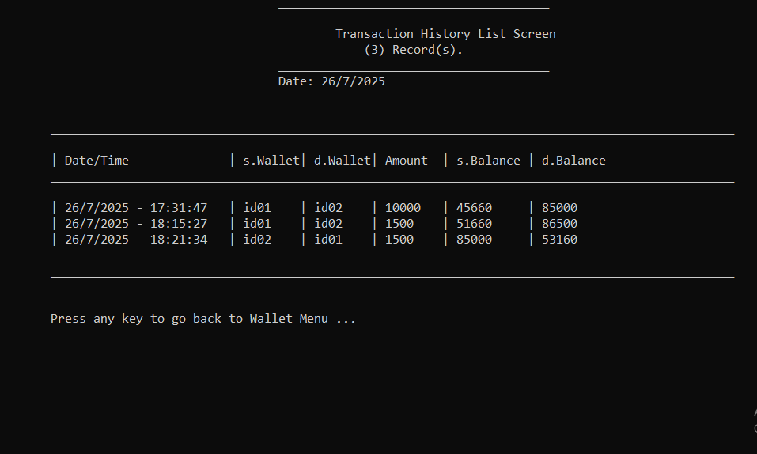

# DigitalWalletSystem
A simple C++ project that simulates a digital wallet management system using file-based data storage.

 Features

-  Create new digital wallets
-  Access existing wallets with PIN code
- DDeposit money into wallet
- Authenticate users with Wallet ID and Pin Code.
- Transfer money between wallets
-  View transaction logs
- Maintain data using plain text file storage.

 Project Structure

- `clsWallet.h/cpp` – Core wallet logic and file I/O.
- `clsPerson.h/cpp` – Base class for shared user properties.
- `clsScreen.h` – Abstracted UI rendering methods.
- `clsMainScreen.h` – Entry-point screen menu.
- `clsCreateNewWalletScreen.h` – Handles wallet creation.
- `clsAccessExistingWalletScreen.h` – Login and transition to wallet operations.
- `clsWalletOperationsMenuScreen.h` – Post-login operations menu.
- `Global.h` – Stores current user session (e.g. `CurrentClientWallet`).

 How It Works

- Data is stored in `WalletsData.txt`.
- Wallets are loaded from file, converted to objects, and manipulated in memory.
- Updates are saved back to the file when changes occur.
- The menu system is navigated via console.

 Technologies

- Language: C++ (standard library only)
- No database – uses file-based storage
- Developed with: Visual Studio

 How to Run

1. Open the project in Visual Studio (or any C++ IDE).
2. Ensure all `.h` and `.cpp` files are included in the solution.
3. Run `main.cpp`.
 Screenshots

---
 by [El-tabbak0x]